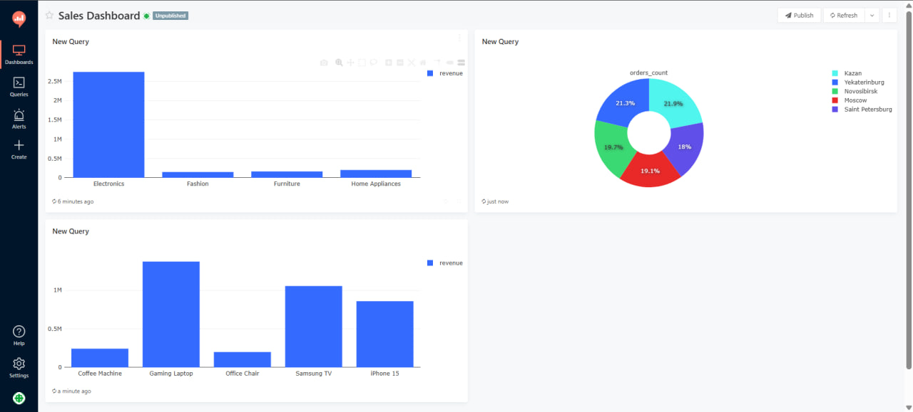

Data Analytics Dashboard (Redash + Docker)

## Описание проекта

Этот проект разворачивает систему аналитики на базе Redash с использованием Docker Compose.

После запуска автоматически:

* поднимается PostgreSQL
* запускается Redis
* стартует Redash
* генератор создаёт тестовые данные заказов
* доступен готовый dashboard с визуализациями

##  Запуск проекта

### Требования

* Docker
* Docker Compose

### Установка

```bash
git clone https://github.com/USERNAME/data-anal.git
cd data-anal
docker compose up
```

После запуска открыть:

http://localhost:5000

---

## Архитектура

* PostgreSQL — хранение данных
* Redis — очередь задач Redash
* Redash — визуализация данных
* Generator — генерация тестовых заказов

---

## Dashboard

В проекте создан dashboard с визуализациями:

* Revenue by Category
* Orders Distribution by City
* Top 5 Products by Revenue

Добавь сюда скриншоты:



---

## Источник данных Redash

Data Source:

```
Host: postgres
Port: 5432
Database: analytics
User: postgres
```

---

## Структура проекта

```
.
├── docker-compose.yml
├── generator/
├── db/
├── screenshots/
└── README.md
```
